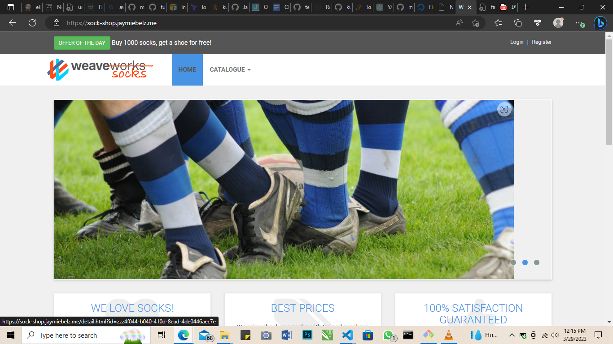
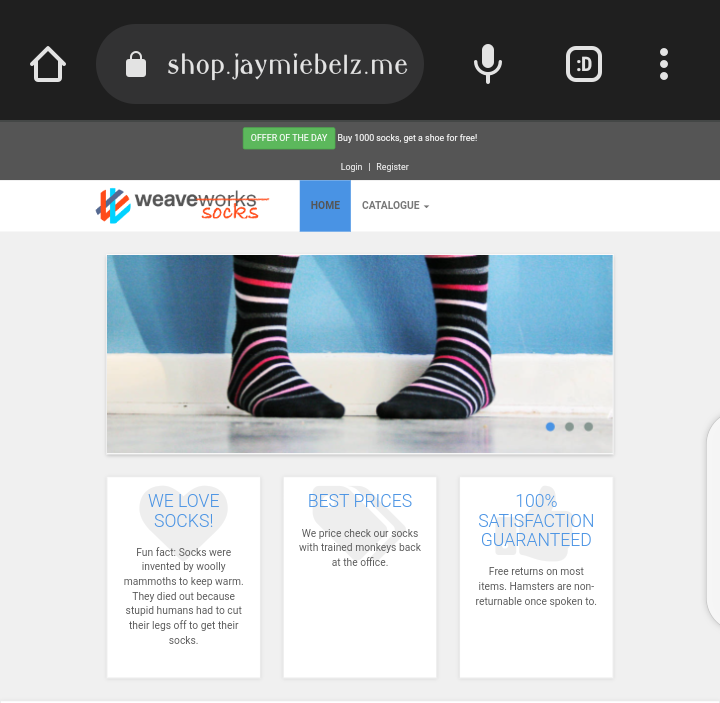
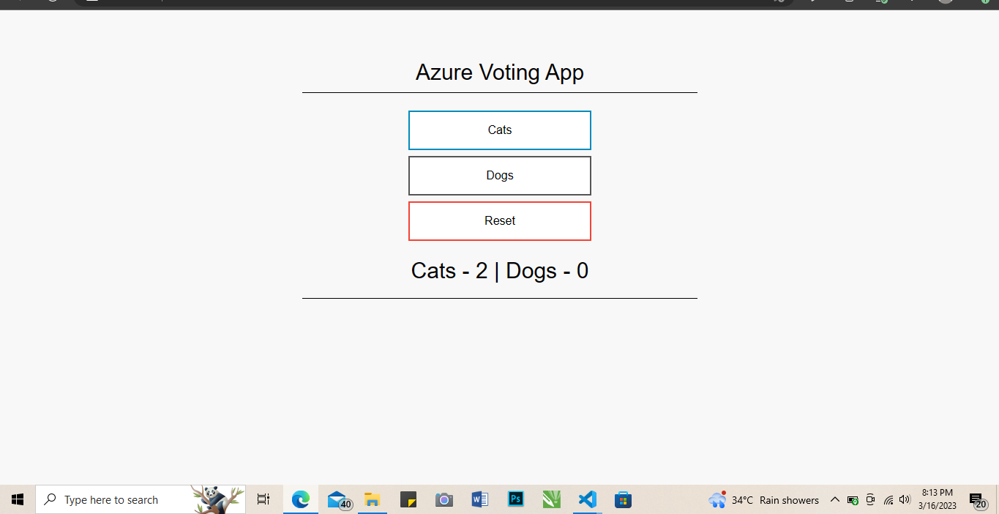
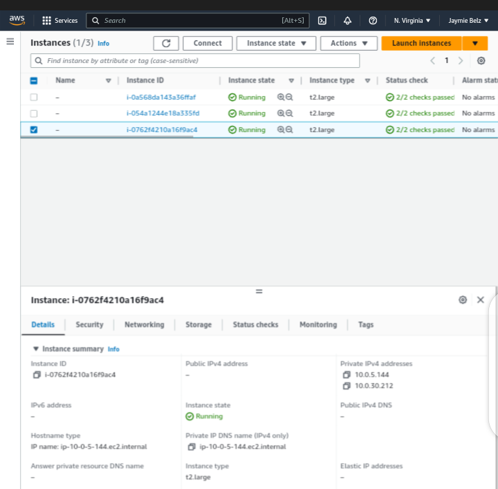
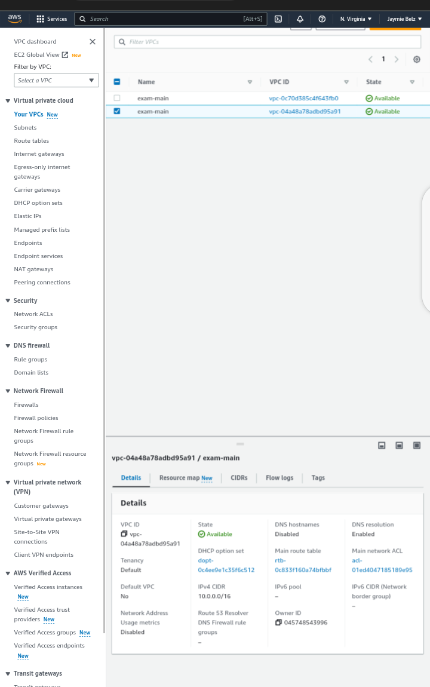

## CloudExam-3rd-Semester

### Sequel to my suspension on AWS, these are the evidence I was able to recover from my infrastructure. Sadly, I couldn't take a screenshot of my Jenkins interface while running it.  

 

Below is my evidence; 
# **sock-shop web interface**:

 

.png)

 

 

# **sock-shop let's encrypt certificate**

 

# **voting-app web interface**

 

# **eks cluster on AWS**

 

# **EC2 resources on AWS**

 

# **VPC2 resources on AWS**

 

**Extra: While testing with Terraform before Jenkins**

